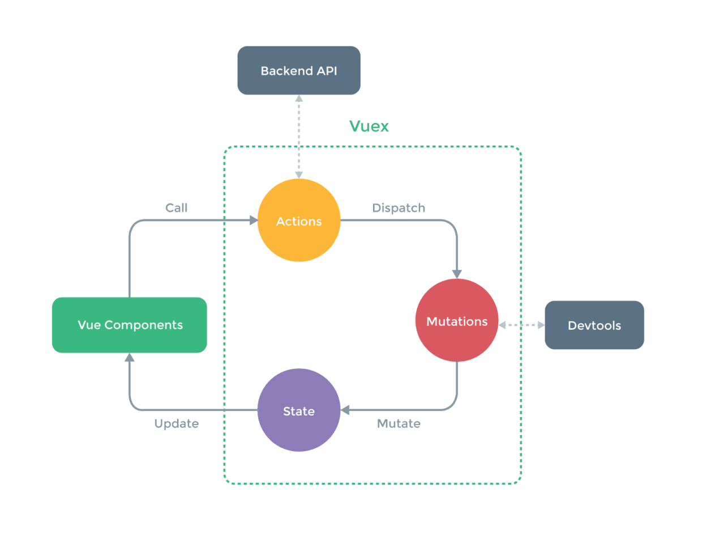

# **lvzu'daily tips**

##   make progress everyday

## _2017/11/09_

### VueX的使用



```javascript
//store为实例化生成的
import store from './store'

new Vue({
  el: '#app',
  store,//状态，触发等的容器
  render: h => h(App)
})
```
store中主要包含state-数据储存，mutations-同步数据改变，actions-异步数据改变
```javascript
const mutations = {...};
const actions = {...};
const state = {...};

Vuex.Store({
  state,
  actions,
  mutation
});
```
后续在组件中使用的过程中，如果想要获取对应的状态你就可以直接使用this.$store.state获取，当然，也可以利用vuex提供的mapState辅助函数将state映射到计算属性中去，如
```javascript
//我是组件
import {mapState} from 'vuex'

export default {
  computed: mapState({
    count: state => state.count
  })
}

<template>
  <span>{{count}}</span>
</template>


```

- Mutations

Mutations的中文意思是“变化”，利用它可以更改状态，本质就是用来处理数据的函数，其接收唯一参数值state。store.commit(mutationName)是用来触发一个mutation的方法。需要记住的是，定义的mutation必须是同步函数，否则devtool中的数据将可能出现问题，使状态改变变得难以跟踪。
```javascript
const mutations = {
  mutationName(state) {
    //在这里改变state中的数据
  }
}

//组件中触发
export default {
  methods: {
    handleClick() {
      this.$store.commit('mutationName')
    }
  }
}

//使用mapMutations||mapActions
import {mapMutations} from 'vuex'

//我是一个组件
export default {
  methods: mapMutations([
    'mutationName'
  ])
}
```

- getters
```javascript
    getters: {
        count: state => state.item.count
    }
```